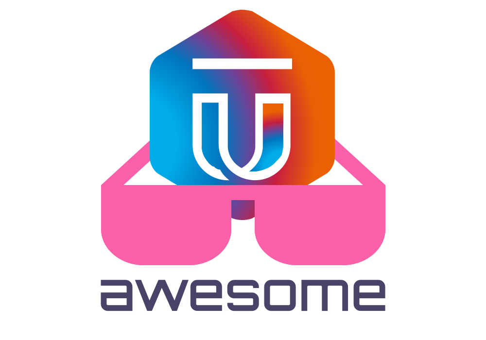

   
  
   
   

## Awesome Ultrain 

> A curated list of awesome things related to Ultrain
> [中文](https://github.com/ultrain-os/awesome-ultrain/blob/master/README_CN.md)链接

- [Resources](#resources)
    - [Official Resources](#official-resources)
    - [External Resources](#external-resources)
    - [Community](#community)
    - [Tutorials](#tutorials)
    - [Tools](#tools)
    - [Examples](#examples)
    
    
    
# Resources

### Official Resources

- [Official Website](https://ultrain.io)
- [Explorer](https://explorer.ultrain.io)
- [Developer](https://developer.ultrain.io)
- [Forum](https://bbs.ultrain.io)
- [GitHub Repo](https://github.com/ultrain-os)
