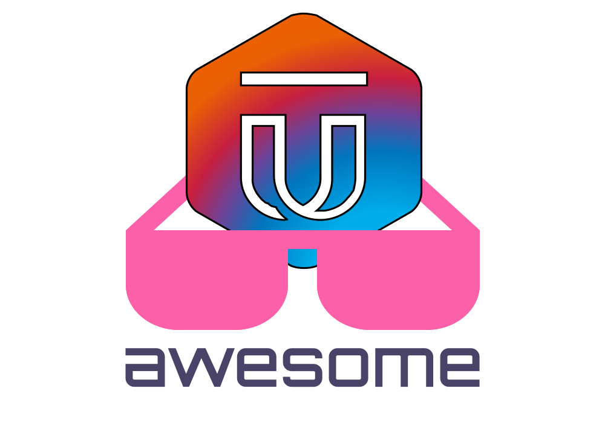

   
  
   
   

## Awesome Ultrain 

> A curated list of awesome things related to Ultrain

- [Resources](#resources)
    - [Official Resources](#official-resources)
    - [External Resources](#external-resources)
    - [Job Portal](#job-portal)
    - [Community](#community)
    - [Conferences](#conferences)
    - [Youtube Channels](#youtube-channels)
    - [Official Examples](#official-examples)
    - [Tutorials](#tutorials)
    - [Examples](#examples)
    - [Books](#books)
    
    
    
# Resources

### Official Resources

- [Official Guide](http://vuejs.org/guide/)
- [API Reference](http://vuejs.org/api/)
- [GitHub Repo](https://github.com/vuejs/vue)
- [Release Notes](https://github.com/vuejs/vue/releases)
- [Style Guide](https://vuejs.org/v2/style-guide/)
- [Vue.js News](https://news.vuejs.org/)
